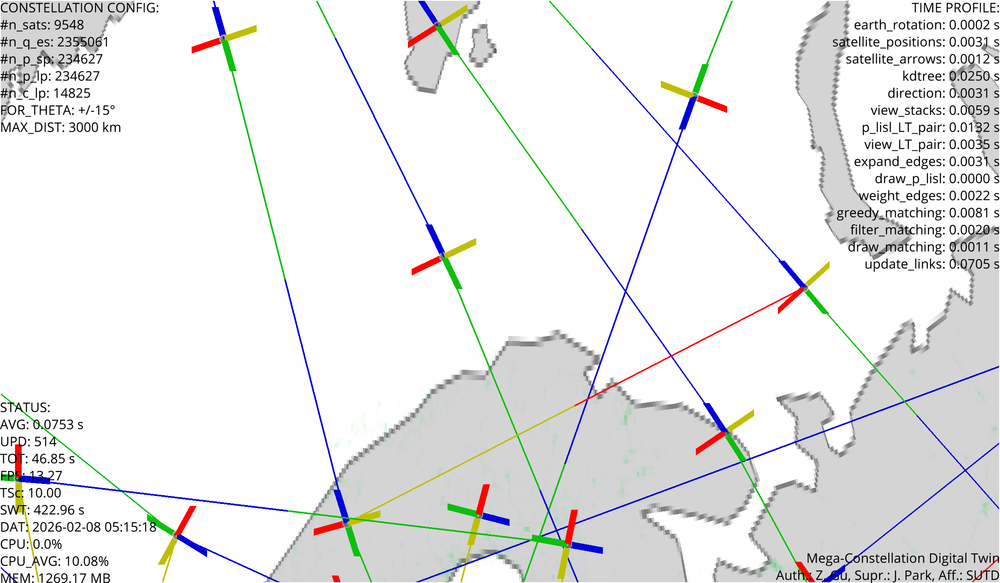

# Satellite Beam Coverage Visualizer
## 3D Real-Time Downlink Beam Footprint Visualization

*Track thousands of Starlink satellites in real time and visualize their downlink beam-coverage footprints on Earth.*



**How many satellites can cover a given point on Earth at any moment?** This tool loads real satellite orbital data (TLE), propagates their positions, and dynamically computes each satellite's beam footprint — showing which regions of Earth are illuminated by satellite downlink beams right now.

## Features

- **Live satellite tracking** — Real TLE data from Celestrak; satellite positions update every frame
- **Dynamic beam-coverage footprints** — Every satellite's beam footprint computed in real time (altitude, Earth radius, minimum elevation angle)
- **Ground station visibility** — Pre-defined ground stations (London, Shanghai) with 3D antenna tower markers; connection lines turn bright blue when covered
- **Antenna tower markers** — Each ground station shown as a 3D vertical antenna pole with a glowing gold beacon on top
- **Cone beam geometry** — Thin lines from each satellite to its coverage-circle edge visualize the 3D beam cone
- **High-performance kernels** — Numba-accelerated computation for thousands of satellites
- **Interactive 3D viewer** — Rotate, zoom, screenshots, and GIF recording

## Beam Coverage Geometry

The coverage footprint is determined by three parameters:

| Parameter | Value | Description |
|-----------|-------|-------------|
| Satellite altitude | 550 km | Height above Earth surface |
| Earth radius | 6,371 km | For angular conversion |
| Min. elevation angle | 25deg | Minimum look-angle above horizon |

From these, the **cone half-angle** (max off-nadir steering angle) and **Earth central angle** (footprint angular radius) are derived using the law of sines. Each satellite's beam footprint is rendered as a light-blue circle, with thin cone lines from satellite to footprint edge.

## Mouse & Keyboard Controls

- **Left-drag** — Rotate camera around Earth
- **Scroll wheel** — Zoom in/out
- **Double-click** — Save a high-res screenshot to `/images/`
- **Left-click (hold)** — Record a GIF

## Configuration

Key parameters in `DigitalTwinConfig` (`simulation.py`):

```python
ground_stations = (
    ("London",   51.5074,  -0.1278),
    ("Shanghai", 31.2304, 121.4737),
)
gs_min_elevation_deg = 25.0     # minimum look-angle for ground user
satellite_altitude_km = 550.0   # beam-footprint radius depends on this
show_coverage = True            # toggle beam visuals
time_scale = 10.0               # simulation speed (10x real-time)
```

## Quick Start

```bash
python -m venv .venv
.\.venv\Scripts\activate        # Windows
# source .venv/bin/activate     # Linux / macOS

pip install -r requirements.txt
python simulation.py
```

First run takes 30--60 seconds for Numba JIT compilation.

## Requirements

- Python 3.9+
- GPU / OpenGL-capable environment (Vispy)

## Performance Tips

- Reduce `time_scale` if FPS is low
- Lower `coverage_num_points` for faster circle rendering
- Use fewer satellites (smaller TLE set)

## License

MIT License. See [LICENSE](LICENSE).
